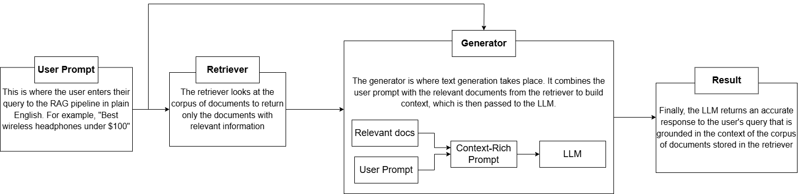

# Amazon Electronics Review Search

This repo uses data of Amazon product & their reviews (specifically for the Electronics category) to compare 2 different retrievals systems: BM25 (keyword-based) and Semantic (embedding-based), to search and compare product results via user queries.

## Description of Dataset

This project uses the [Amazon Reviews 2023](https://amazon-reviews-2023.github.io/) dataset, focusing on the **Electronics** category. This can also be found in [Hugging Face Website]( https://huggingface.co/datasets/McAuley-Lab/Amazon-Reviews-202). It combines two data sources:

- **Reviews** (`Electronics.jsonl.gz`): dataset of individual user reviews with fields including `rating`, `text`, `asin`, `parent_asin`, `user_id`, `timestamp`, `helpful_vote`, and `verified_purchase`
- **Metadata** (`meta_Electronics.jsonl.gz`): dataset of product-level information including `title`, `price`, `average_rating`, `main_category`, and `store`

These two sources are joined on `parent_asin` to produce a merged dataset (reproducing the work flow instructions below). 

### Preprocessing:

Via EDA done in `milestone_exploration.ipynb`, some columns were dropped or converted in a more palatable way for document creation/pipeline requirements. More explanation can be found there. 

In short: the following columns were dropped in meta `["images", "videos", "subtitle", "author", "bought_together", "rating_number", "average_rating", "price", "store"]` and only `["title", "helpful_vote", "parent_asin"]` was retained in reviews. The dropped columns either do not work well in the retrieval pipeline without serious extra steps (images/videos) or would increase the document size without meaningful additions. The second reason (lack of meaningful additions) is also the main reason why so many of the review columns were dropped - as the document size would explode - but only add noise.

## Current Types of Retrieval Systems:

Currently there are 2 types of retrieval systems being explored:

1. BM25 -> Keyword TF-IDF based. Expected to preform the best when there's high exact-word matching between a query and the products.

2. Semantic -> Embedding-based. Expected to preform the best when there's a more natural language or conceptual queries and the products semantic best match the overall meaning and intent of the user query.capturing meaning beyond exact keyword overlap.

3. RAG (Retrieval-Augmented Generation) → Combines the retrieval step with a generative language model (llm response). The retrieved documents are passed as context to the model, which then give a more natural language response that's grounded in context of the product data. Two RAG workflows are available planned:

    - Semantic RAG: uses the semantic (embedding-based) retriever to fetch relevant documents, then passes them to the generative model.
    - Hybrid RAG: uses a hybrid of BM25 and semantic retrieval before passing results to the generative model, aiming to combine the strengths of both approaches.

A diagram of the workflow can be seen below:


### Model Choice for RAG:
For the RAG workflow, we use Qwen/Qwen2.5-0.5B as our generative model. This was chosen to try balance performance with our local compute constraints — the larger 1.5B variant of the same family was ruled out due to response times being too slow within the Shiny app. As a decoder-only model, it is well suited for the text generation step in a RAG pipeline. Alternative decoder-only models that could be use include `microsoft/phi-2`, `microsoft/phi-3-mini-4k-instruct`, and `google/gemma-2-2b-it, but they are subject to local computing power.

## Recreating Project Workflow

> NOTE: If files in `data/processed` are removed -> Steps 1-4 must be done first before running the milestone1_exploration (requires parquet format).

> NOTE: If short on time: steps 3 & 4 (which are very time consuming) can be skipped. This works since subset versions of data sources (already converted) are already exported to the repo - and the pipeline currently just uses a subset due to time constraints.

### 1. Clone the Repository
Clone the repo into the desired folder using this command in a new terminal window:
```bash
git clone git@github.com:UBC-MDS/DSCI_575_project_dianacor_roccolee.git
cd DSCI_575_project_dianacor_roccolee
```

### 2. Create and Activate the Environment
Make and activate the environment using the command below in the same terminal (at the root of the repo): 
```bash
conda env create -f environment.yml
conda activate amazon-recommender # or whatever the custom env name might be
```

### 3. Download the Dataset
> Note: Downloads are very large. Expect 45–60+ minutes depending on your connection. The automated method may be even slower due to server-side rate limits.

**Option A — Manual download  (recommended):**
1. Go to the [dataset website](https://amazon-reviews-2023.github.io/).
2. Locate the *Electronics* category.
3. Download both the reviews and metadata files via the clickable links.
4. Move the zip files to `data/raw/`
5. Extract them in place

**Option B — Automated download**:
```bash
# Via terminal in the root project directory 
python ./src/0_direct_datadownload.py 
```

### 4. Convert to Parquet, merge sources & export subsets
Run bellow code to convert from .jsonl / .json.gz to parquet:
> This step might also take quite long due to the large files conversion and merging the two. Estimated to be ~10-15 minutes.

```bash
python src/1_convert_parquet.py 
python src/2_merge_sources.py
python src/3_export_subsets.py --sample-size 10000
```
### 5. Create Search Documents
This prepares the processed data as document objects used by the retrieval systems.

```bash
python src/4_create_documents.py
```

### 6. Run Retrievals

This creates and exports the required embeddings and index's for both retrieval methods. Both scripts accept a `--query` argument to test out a custom query for each respective method (ex: `<...>.py --query "sony headphones"`) - but this is a optional feature and not required.

```bash
python src/5_bm25.py  # BM25 (keyword-based) search
python src/6_semantic.py # Semantic search
```

## 7. (OPTIONAL) Run Basic Retrievals on Example Queries
This runs examples queries that are available in `results/queries.csv` (this can be changed an customized if desired) against both retrieval methods and outputs the results in `results/query_results.csv`. From these example queries provided a handful were chosen to compare, reflect and review the performance of the methods. 

> Disclaimer: if this is re-run, the reflections made in `milestone1_discussion.md` may not match up since the sample size of the documents is now larger than when the analysis was done.

```bash
python src/7_retrieval_metrics.py
```

## 8. (OPTIONAL) Run semantic RAG pipelines
```bash
#To preview specific-semantic RAG with an example query, run:
python src/8_rag_pipeline.py --query "1080p gaming monitor with high refresh rate and good color accuracy"
```

## 8. Run Hybrid RAG pipelines on Example Queries
```bash
#To preview hybrid-semantic RAG with an example query, run:
# python src/9_hybrid.py --query "1080p gaming monitor with high refresh rate and good color accuracy"

# To run all the example Queries and export a comparison between
python src/9_hybrid.py
```

### Run the Web App

You can also experiment with query search's through a web app by running:

```bash
shiny run ./app/app.py
```

Then open the URL shown in your terminal. If you want to experiment with a retriever-only search, stay in the "Search Only" tab and use the dropdown to select which retriever you would like to use for your query. If you would prefer to experiment with the Hybrid RAG pipeline, switch to the "RAG Mode" tab, enter your query and press the "Ask" button. **Note that this step may take a while**
